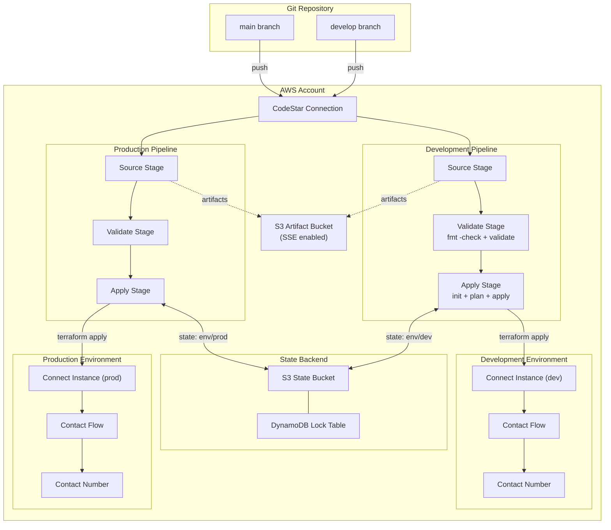
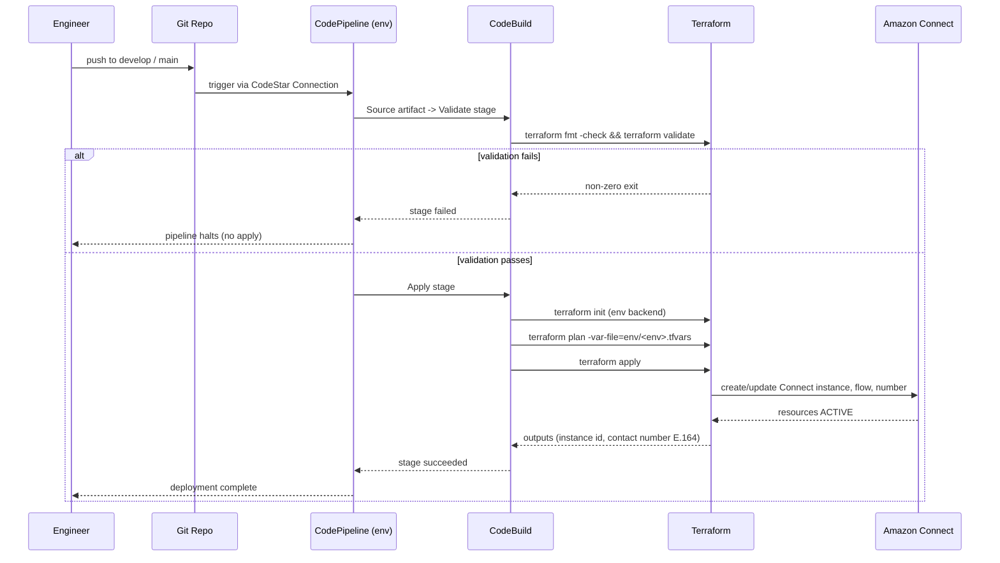

# Design Document

## Overview

This design describes a Terraform-based CI/CD solution that provisions AWS-native pipeline infrastructure (CodePipeline + CodeBuild) and uses it to automate deployment of an Amazon Connect contact center across two fully isolated environments (Development and Production).

The solution is structured around a clear separation of concerns:

1. **Bootstrap layer** — creates the remote state backends (S3 + DynamoDB) and the CodeStar Connection that the rest of the system depends on. This is the only layer applied manually, once per AWS account.
2. **CI/CD layer** — Terraform that provisions the pipeline infrastructure (CodePipeline, CodeBuild projects, artifact bucket, IAM roles). One pipeline per environment, each triggered by a designated Git branch.
3. **Application layer** — Terraform that provisions the Amazon Connect instance, contact flows, and phone numbers. This layer is *applied by the pipeline*, not by hand.

The driving principle is that engineers interact with the system exclusively through Git: a commit to the `develop` branch deploys to Development, and a commit to `main` deploys to Production. The pipeline runs `terraform fmt -check`, `terraform validate`, `terraform plan`, and `terraform apply` against the application layer, with each environment's state stored in an isolated backend.

### Goals

- Automate Amazon Connect deployment end-to-end through AWS-native CI/CD.
- Enforce strict environment isolation through separate state backends and separate pipelines.
- Follow Terraform best practices (typed variables, described outputs, pinned providers, modules, consistent naming).
- Provide comprehensive documentation so a new engineer can deploy with no prior exposure.

### Key Design Decisions

| Decision | Choice | Rationale |
|---|---|---|
| State isolation | Separate S3 **key** per environment in a shared bucket, separate DynamoDB lock table entries | Simplest isolation that guarantees `state list` in one env never returns another env's resources (Req 4.2). Distinct keys avoid cross-env state contention. |
| Pipeline topology | One CodePipeline **per environment** | Cleaner branch-to-environment mapping, independent execution, independent failure domains (Req 4.7, 5.5). |
| Source integration | CodeStar Connections (GitHub/Git) | Native branch-trigger support, no polling, supports per-branch source configuration (Req 5.1, 5.2). |
| CI/CD vs application separation | Separate root modules in separate directories, each with own backend | Satisfies Req 1.8 and prevents the pipeline from being able to destroy itself. |
| Connect identity management | `CONNECT_MANAGED` default, overridable | Lowest setup friction for a sample contact center (Req 3.1). |
| Environment selection | One `.tfvars` file per environment passed via CodeBuild env var | Explicit, auditable, matches Req 4.6. |

## Architecture

### Repository Structure

```
terraform-cicd-solution/
├── README.md                        # Root README (Req 7.5)
├── docs/                            # Documentation_Set (Req 6)
│   ├── architecture.md
│   ├── code-structure.md
│   ├── environment-strategy.md
│   ├── cicd-workflow.md
│   ├── deployment-guide.md
│   ├── troubleshooting.md
│   └── faq.md
├── bootstrap/                       # Applied manually, once per account
│   ├── main.tf                      # S3 state bucket, DynamoDB lock table, CodeStar Connection
│   ├── variables.tf
│   ├── outputs.tf
│   └── providers.tf
├── cicd/                            # CI/CD layer (Req 1.8)
│   ├── main.tf                      # Wires pipeline module per environment
│   ├── variables.tf
│   ├── outputs.tf
│   ├── providers.tf
│   ├── backend.tf
│   ├── data.tf
│   └── env/
│       ├── dev.tfvars
│       └── prod.tfvars
├── application/                     # Application layer (Req 1.8)
│   ├── main.tf                      # Wires connect module
│   ├── variables.tf
│   ├── outputs.tf
│   ├── providers.tf
│   ├── backend.tf
│   ├── data.tf
│   ├── env/
│   │   ├── dev.tfvars
│   │   └── prod.tfvars
│   └── flows/
│       ├── inbound-greeting.json    # Contact_Flow content (Req 3.6)
│       └── ...
├── modules/
│   ├── pipeline/                    # Reusable CI/CD module (Req 1.7)
│   │   ├── main.tf
│   │   ├── variables.tf
│   │   ├── outputs.tf
│   │   └── README.md
│   ├── connect/                     # Reusable Connect module (Req 1.7)
│   │   ├── main.tf
│   │   ├── variables.tf
│   │   ├── outputs.tf
│   │   └── README.md
│   └── iam/                         # Reusable least-privilege IAM module
│       ├── main.tf
│       ├── variables.tf
│       ├── outputs.tf
│       └── README.md
└── buildspecs/
    ├── validate.yml                 # fmt -check + validate (Req 2.6)
    └── apply.yml                    # init + plan + apply (Req 2.5)
```

The `bootstrap`, `cicd`, and `application` directories are independent Terraform root modules, each with its own `backend.tf`. This guarantees the CI/CD infrastructure and the Connect application never share state (Req 1.8).

### System Architecture Diagram



### Deployment Sequence



## Components and Interfaces

### Bootstrap Module (manual, once per account)

Provisions prerequisites that cannot be self-managed by the pipeline:

- **S3 state bucket** — versioning enabled, SSE enabled, public access blocked.
- **DynamoDB lock table** — `LockID` (String) hash key, on-demand billing.
- **CodeStar Connection** — to the Git provider; requires a one-time manual handshake in the console to move from `PENDING` to `AVAILABLE`.

Outputs: state bucket name, lock table name, connection ARN. These are fed into the CI/CD layer as variables.

### Pipeline Module (`modules/pipeline`)

A reusable module instantiated once per environment by the `cicd` root module.

**Inputs (variables):**

| Variable | Type | Description |
|---|---|---|
| `project_name` | `string` | Project prefix for naming (Req 1.5) |
| `environment` | `string` | Environment name (`dev`/`prod`) |
| `aws_region` | `string` | Target region (Req 1.3, 2.8) |
| `source_branch` | `string` | Branch that triggers this pipeline (Req 5.5) |
| `connection_arn` | `string` | CodeStar Connection ARN |
| `repository_id` | `string` | `owner/repo` identifier |
| `artifact_bucket_arn` | `string` | Pipeline artifact bucket |
| `state_bucket_arn` | `string` | State backend bucket (for IAM scoping) |
| `lock_table_arn` | `string` | DynamoDB lock table (for IAM scoping) |
| `tfvars_file` | `string` | Path to the env tfvars file (Req 4.6) |

**Resources:** `aws_codepipeline`, two `aws_codebuild_project` resources (validate + apply), `aws_s3_bucket` artifact store (SSE), `aws_iam_role` + scoped policies via the IAM module.

**Outputs:** `pipeline_arn` (Req 1.2), `pipeline_name`, `codebuild_validate_name`, `codebuild_apply_name`.

**Pipeline stages:**

1. **Source** — `CodeStarSourceConnection` action, `BranchName = source_branch`, `DetectChanges = true` (Req 2.1, 5.1, 5.2).
2. **Validate** — CodeBuild action running `buildspecs/validate.yml` (Req 2.6). On failure the pipeline halts (Req 2.9, 9).
3. **Apply** — CodeBuild action running `buildspecs/apply.yml` (Req 2.5).

### Connect Module (`modules/connect`)

A reusable module instantiated by the `application` root module.

**Inputs (variables):**

| Variable | Type | Description |
|---|---|---|
| `project_name` | `string` | Project prefix |
| `environment` | `string` | Environment name |
| `identity_management_type` | `string` | Default `CONNECT_MANAGED` (Req 3.1) |
| `instance_alias` | `string` | Connect instance alias |
| `phone_number_type` | `string` | `DID` or `TOLL_FREE` (Req 3.3) |
| `phone_number_country_code` | `string` | ISO country code (Req 3.3) |
| `contact_flow_files` | `map(string)` | Map of flow name -> JSON file path (Req 3.6) |

**Resources:** `aws_connect_instance`, `aws_connect_contact_flow` (one per flow file), `aws_connect_phone_number` mapped to the flow (Req 3.2, 3.3).

**Outputs:** `connect_instance_id` (Req 1.2), `contact_number_e164` (Req 3.5), `contact_flow_ids`.

### IAM Module (`modules/iam`)

Builds least-privilege roles for CodePipeline and CodeBuild (Req 2.4). Policies are scoped by ARN to:

- The artifact S3 bucket (`s3:GetObject`, `s3:PutObject`, `s3:GetBucketVersioning` on that bucket only).
- The CloudWatch Logs log group for the CodeBuild project (`logs:CreateLogStream`, `logs:PutLogEvents`).
- The state backend bucket key prefix and the DynamoDB lock table item.
- The CodeStar Connection (`codestar-connections:UseConnection`).
- The Amazon Connect API surface required by `terraform apply` for the application layer.

### Buildspecs

**`validate.yml`** (Validate stage):

```yaml
version: 0.2
phases:
  build:
    commands:
      - cd application
      - terraform fmt -check -recursive
      - terraform init -backend=false
      - terraform validate
```

**`apply.yml`** (Apply stage):

```yaml
version: 0.2
env:
  variables:
    TF_ENV: ""        # injected per pipeline (dev/prod)
    AWS_REGION: ""    # injected per pipeline (Req 2.8)
phases:
  build:
    commands:
      - cd application
      - terraform init -backend-config="key=connect/${TF_ENV}/terraform.tfstate"
      - terraform plan -var-file="env/${TF_ENV}.tfvars" -out=tfplan || { echo "Terraform plan failed"; exit 1; }
      - terraform apply -auto-approve tfplan || { echo "Terraform apply failed"; exit 1; }
```

The explicit failure echo and non-zero exit satisfy Req 2.7 (report failing command and error output in logs).

## Data Models

### Environment Configuration (tfvars)

Each environment is described by a tfvars file. Example `application/env/dev.tfvars`:

```hcl
environment               = "dev"
project_name              = "connectcc"
aws_region                = "us-east-1"
identity_management_type  = "CONNECT_MANAGED"
instance_alias            = "connectcc-dev"
phone_number_type         = "DID"
phone_number_country_code = "US"
contact_flow_files = {
  "inbound-greeting" = "flows/inbound-greeting.json"
}
```

### Resource Naming Convention

All resources follow `<project>-<environment>-<resource_type>-<identifier>` (Req 1.5), implemented through a `locals` block:

```hcl
locals {
  name_prefix = "${var.project_name}-${var.environment}"
  # e.g. connectcc-dev-pipeline-deploy
}
```

### State Backend Layout

| Layer | Bucket | Key | Lock |
|---|---|---|---|
| CI/CD (dev) | `<project>-tfstate` | `cicd/dev/terraform.tfstate` | shared DynamoDB table |
| CI/CD (prod) | `<project>-tfstate` | `cicd/prod/terraform.tfstate` | shared DynamoDB table |
| Application (dev) | `<project>-tfstate` | `connect/dev/terraform.tfstate` | shared DynamoDB table |
| Application (prod) | `<project>-tfstate` | `connect/prod/terraform.tfstate` | shared DynamoDB table |

Distinct keys per environment guarantee `terraform state list` in one environment returns no resources from another (Req 4.2, 4.4).

### Contact Flow Definition

Contact flows are stored as Amazon Connect flow-language JSON in `application/flows/`. Example structure (abbreviated):

```json
{
  "Version": "2019-10-30",
  "StartAction": "play-greeting",
  "Actions": [
    {
      "Identifier": "play-greeting",
      "Type": "MessageParticipant",
      "Parameters": { "Text": "Thank you for calling the sample contact center." },
      "Transitions": { "NextAction": "disconnect" }
    },
    {
      "Identifier": "disconnect",
      "Type": "DisconnectParticipant",
      "Parameters": {},
      "Transitions": {}
    }
  ]
}
```

The flow content lives in the repo so engineers can edit and commit it (Req 3.6, 3.7, 5.6).

### Terraform Outputs

| Output | Layer | Description | Requirement |
|---|---|---|---|
| `connect_instance_id` | application | The Connect instance ID | 1.2 |
| `contact_number` | application | Claimed number in E.164 format | 1.2, 3.5 |
| `pipeline_arn` | cicd | CodePipeline ARN | 1.2 |

## Error Handling

| Failure Scenario | Detection | Handling | Requirement |
|---|---|---|---|
| `terraform validate` / `fmt` fails | Validate stage non-zero exit | Pipeline halts before Apply stage; failure visible in CodeBuild logs | 2.6, 2.9, 9 |
| `terraform plan`/`apply` fails | Apply stage buildspec captures non-zero exit | Echo the failing command + Terraform error output, exit non-zero, pipeline marks stage failed | 2.7 |
| Connect service limit / regional unavailability | Terraform AWS provider error on apply | Surfaced through Terraform error output naming the resource and reason; no partial silent success | 3.8 |
| State lock conflict | DynamoDB conditional check failure | Documented in troubleshooting; resolved via `force-unlock` after confirming no concurrent run | 6.6 |
| CodeStar Connection in `PENDING` | Source stage cannot start | Bootstrap docs require manual one-time handshake before first run | 5.2 |
| IAM permission error in CodeBuild | AccessDenied in build logs | Least-privilege policies documented; troubleshooting entry maps action to required permission | 2.4, 6.6 |
| Cross-environment contamination | Distinct backend keys per env | Architecturally prevented; a prod run cannot read/write dev state | 4.2, 4.4 |

### Idempotency and Safety

- The pipeline only applies the **application** layer; it has no permission to modify the CI/CD or bootstrap layers, so it cannot destroy itself.
- `terraform plan -out=tfplan` followed by `apply tfplan` ensures the applied changes are exactly what was reviewed in the plan, avoiding drift between plan and apply.
- Re-running a pipeline with no source changes results in a no-op apply (Terraform's natural idempotency).

## Testing Strategy

### Why Property-Based Testing Does Not Apply

This feature is **Infrastructure as Code**. Its artifacts are declarative Terraform configurations and Amazon Connect flow JSON, not pure functions with input/output behavior. There is no algorithm, parser, serializer, or business-logic transformation that we own and could exercise with randomized inputs to assert a universal "for all inputs, property P holds" statement. The behavior under test belongs to AWS services (CodePipeline orchestration, CodeBuild execution, Connect provisioning) and the Terraform engine itself, both of which are already tested by their authors.

Accordingly, the **Correctness Properties section is intentionally omitted**, and testing relies on the IaC-appropriate strategies below.

### 1. Static Validation (every commit, Validate stage)

- `terraform fmt -check -recursive` across all configurations — fails on any formatting difference (Req 1.9, 2.6).
- `terraform validate` for `bootstrap`, `cicd`, and `application` — fails on invalid configuration (Req 1.9).
- Optional linting: `tflint` for provider best practices and `checkov`/`tfsec` for IAM and encryption policy checks.

### 2. Plan-Based Snapshot / Assertion Tests

Using Terraform's native test framework (`terraform test`, `.tftest.hcl`) with `command = plan` and mocked providers, assert that the planned configuration has the expected shape without provisioning real resources:

- Artifact S3 bucket has server-side encryption configured (Req 2.3).
- CodePipeline contains Source, Validate, and Apply stages in order (Req 2.1, 2.5, 2.6).
- IAM policies are scoped to specific resource ARNs and contain no wildcard `Resource = "*"` for the artifact bucket, logs, and state backend statements (Req 2.4).
- Connect module plans an instance with `identity_management_type` defaulting to `CONNECT_MANAGED` (Req 3.1).
- Phone number resource references a contact flow ID (Req 3.3).
- Resource names match the `<project>-<environment>-<resource_type>-<identifier>` pattern (Req 1.5).
- Each environment's backend key is distinct (Req 4.2).

### 3. Schema / Structure Validation

- Validate each contact flow JSON against the Amazon Connect flow-language schema (well-formed JSON, required `Version`, `StartAction`, reachable `Actions`) before commit (Req 3.2, 3.6).
- Validate that each environment tfvars file defines the required keys: `environment`, `project_name`, naming prefix, and sizing values (Req 4.3).

### 4. Integration Tests (1–3 representative runs per environment)

These verify real AWS behavior and serve as deployment evidence (Req 7.2, 7.3):

- Run the Development pipeline end-to-end; assert pipeline execution reaches `Succeeded` and Terraform outputs include an E.164 contact number (Req 3.4, 3.5).
- Verify the Connect instance reaches `ACTIVE` status and the contact number is associated with the contact flow (Req 3.4, 7.3).
- Push a contact-flow edit to `develop` and confirm the pipeline redeploys the updated flow (Req 3.7, 5.6).
- Confirm a state-list in dev returns no prod resources and vice versa (Req 4.2, 4.4).

### 5. Smoke Tests (one-time setup checks)

- CodeStar Connection status is `AVAILABLE` before first pipeline run (Req 5.2).
- State bucket has versioning + encryption enabled; lock table exists (Req 1.4).
- Validate stage correctly halts the pipeline on an intentionally malformed configuration (Req 2.9, 9).

### Test-to-Requirement Coverage Summary

| Requirement area | Primary test type |
|---|---|
| 1.x Terraform best practices | Static validation + plan assertions |
| 2.x CI/CD infrastructure | Plan assertions + integration |
| 3.x Connect deployment | Integration + schema validation |
| 4.x Multi-environment | Plan assertions + integration |
| 5.x Git-driven workflow | Integration |
| 6.x / 7.x Documentation & evidence | Manual review + pipeline execution history |
