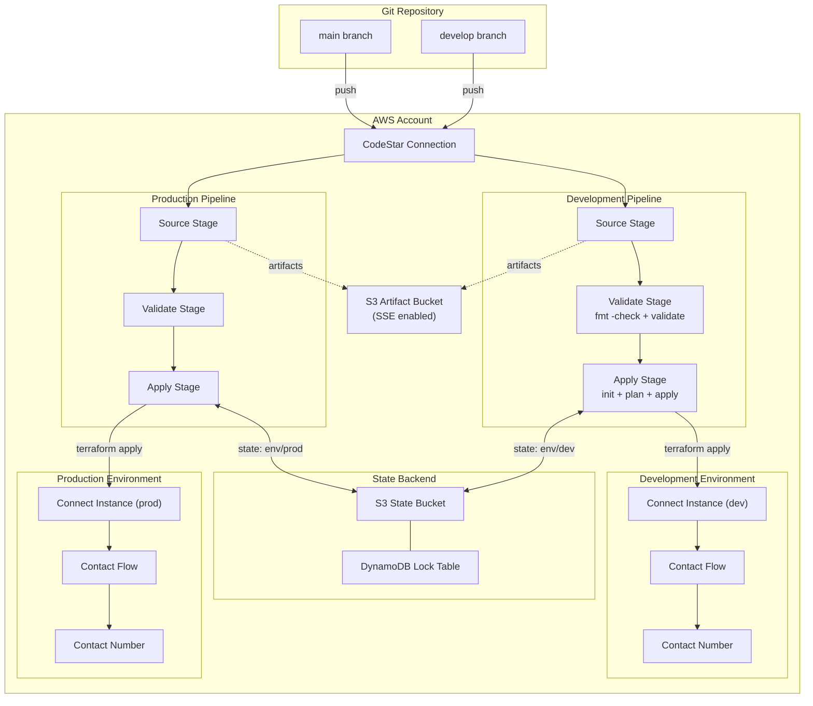

# Terraform CI/CD Solution for Amazon Connect

A Terraform-based CI/CD solution that provisions AWS CodePipeline and CodeBuild to automate the deployment of an Amazon Connect contact center across multiple isolated environments.

## Project Summary

This solution demonstrates end-to-end infrastructure-as-code practices by using Terraform to create both the CI/CD pipeline infrastructure and the Amazon Connect instance with associated contact flows. Engineers update Connect flows in the source repository, commit changes, and the pipeline automatically deploys updates to the target environment.

The final output is a functional sample contact center with contact numbers associated with deployed flows.

### Key Features

- Fully automated deployments triggered by Git commits
- Two isolated environments: Development (`develop` branch) and Production (`main` branch)
- Separate Terraform state per environment preventing cross-environment contamination
- Least-privilege IAM roles scoped to specific resources
- Validation stage (format check + validate) that halts the pipeline on failure
- Reusable Terraform modules for pipeline, Connect, and IAM resources

## Architecture Overview

The solution is organized into three layers:

| Layer | Purpose | Applied By |
|-------|---------|------------|
| **Bootstrap** | Remote state backend (S3 + DynamoDB) and CodeStar Connection | Manual, once per account |
| **CI/CD** | Pipeline infrastructure (CodePipeline, CodeBuild, artifact bucket, IAM) | Manual or pipeline |
| **Application** | Amazon Connect instance, contact flows, phone numbers | Pipeline (automated) |

### System Architecture



### Deployment Flow

1. Engineer pushes code to `develop` or `main` branch
2. CodeStar Connection triggers the corresponding CodePipeline
3. **Validate Stage** — runs `terraform fmt -check` and `terraform validate`; halts on failure
4. **Apply Stage** — runs `terraform init`, `terraform plan`, and `terraform apply`
5. Amazon Connect resources are created/updated in the target environment

### Resource Naming Convention

All resources follow the pattern: `<project>-<environment>-<resource_type>-<identifier>`

Example: `connectcc-dev-pipeline-deploy`

## Repository Structure

```
.
├── README.md                 # This file
├── bootstrap/                # One-time setup: state backend + CodeStar Connection
├── cicd/                     # CI/CD layer: pipelines, CodeBuild, IAM
├── application/              # Application layer: Connect instance, flows, numbers
│   └── flows/                # Contact flow JSON definitions
├── modules/
│   ├── pipeline/             # Reusable pipeline module
│   ├── connect/              # Reusable Connect module
│   └── iam/                  # Reusable IAM module
├── buildspecs/               # CodeBuild buildspec files (validate + apply)
└── docs/                     # Detailed documentation
```

## Prerequisites

Before deploying this solution, ensure you have:

- **AWS Account** with permissions to create CodePipeline, CodeBuild, S3, DynamoDB, IAM, and Amazon Connect resources
- **Terraform** >= 1.5.0 installed ([download](https://developer.hashicorp.com/terraform/downloads))
- **AWS CLI** v2 configured with credentials for the target account ([install guide](https://docs.aws.amazon.com/cli/latest/userguide/getting-started-install.html))
- **Git** installed and configured with access to the source repository
- A **GitHub** (or supported Git provider) account for the CodeStar Connection

## Quick Start

### 1. Clone the Repository

```bash
git clone <repository-url>
cd terraform-cicd-solution
```

### 2. Bootstrap the State Backend

```bash
cd bootstrap
terraform init
terraform apply
```

This creates the S3 state bucket, DynamoDB lock table, and CodeStar Connection. After apply, complete the CodeStar Connection handshake in the AWS Console (one-time manual step).

### 3. Deploy CI/CD Infrastructure

```bash
cd ../cicd
terraform init
terraform apply -var-file="env/dev.tfvars"   # Development pipeline
terraform apply -var-file="env/prod.tfvars"  # Production pipeline
```

### 4. Trigger Deployments via Git

Once the pipelines are provisioned:

- Push to `develop` branch → deploys to Development environment
- Push to `main` branch → deploys to Production environment

The pipeline will automatically validate and apply the application layer Terraform, provisioning the Amazon Connect instance, contact flows, and phone numbers.

### 5. Verify Deployment

After a successful pipeline run, check the Terraform outputs:

```bash
cd ../application
terraform output connect_instance_id
terraform output contact_number
```

## Documentation

For detailed documentation, see the [docs/](docs/) directory:

| Document | Description |
|----------|-------------|
| [Architecture](docs/architecture.md) | Solution architecture with diagrams |
| [Code Structure](docs/code-structure.md) | Terraform code organization and design decisions |
| [Environment Strategy](docs/environment-strategy.md) | Environment isolation and state separation |
| [CI/CD Workflow](docs/cicd-workflow.md) | Pipeline stages, triggers, and buildspec logic |
| [Deployment Guide](docs/deployment-guide.md) | Step-by-step deployment instructions |
| [Troubleshooting](docs/troubleshooting.md) | Common issues and resolution steps |
| [FAQ](docs/faq.md) | Frequently asked questions |

## License

This project is provided as a sample solution for demonstration purposes.
